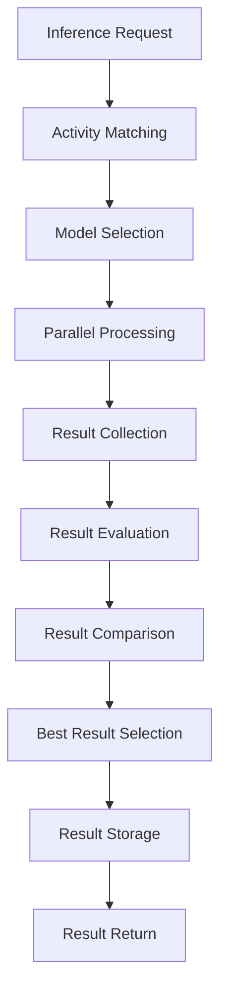

# Multi-Model Inference System

This document outlines the Multi-Model Inference System, a component of the human-in-the-loop agent architecture that enables multiple AI models to process the same inference requests for comparison and selection.

## 1. Overview

The Multi-Model Inference System allows the same prompt to be processed by different AI models, comparing their outputs to select the best result. This approach provides several benefits:

- **Quality Improvement**: Selecting the best output from multiple models
- **Specialization**: Using models optimized for specific activities
- **Redundancy**: Fallback options if a model fails or produces poor results
- **Evaluation**: Comparing model performance across different tasks
- **Cost Optimization**: Balancing quality and cost across models

## 2. System Components

### 2.1 Inference Management

```
└── inference/
    ├── inference_manager.mjs    # Manages inference requests
    ├── model_registry.mjs       # Registers available models
    ├── request_router.mjs       # Routes requests to appropriate models
    ├── result_comparator.mjs    # Compares results from different models
    ├── result_evaluator.mjs     # Evaluates quality of inference results
    └── inference_optimizer.mjs  # Optimizes inference requests
```

### 2.2 Model Registry

The Model Registry maintains information about available models:

```javascript
{
  model_id: 'string', // Unique identifier
  name: 'string', // Human-readable name
  provider: 'string', // Model provider (OpenAI, Anthropic, etc.)
  version: 'string', // Model version
  capabilities: [], // Array of capability tags
  strengths: [], // Areas where model excels
  weaknesses: [], // Areas where model struggles
  cost_per_token: {
    input: 'number', // Cost per input token
    output: 'number' // Cost per output token
  },
  context_window: 'number', // Maximum context window size
  preferred_activities: [], // Activities this model is preferred for
  api_config: {}, // Configuration for API calls
  status: 'string', // 'active', 'inactive', 'deprecated'
  created_at: 'timestamp',
  updated_at: 'timestamp'
}
```

### 2.3 Inference Request Schema

```javascript
{
  request_id: 'string', // Unique identifier
  prompt: 'string', // The prompt text
  activities: [], // Associated activities
  guidelines: [], // Guidelines to follow
  context_data: [], // Additional context data IDs
  models: [], // Models to use for inference
  evaluation_criteria: [], // How to evaluate the results
  created_at: 'timestamp',
  status: 'string', // 'pending', 'processing', 'completed', 'failed'
  results: [
    {
      model_id: 'string', // ID of the model used
      output: 'string', // Model output
      evaluation: {}, // Evaluation results
      selected: 'boolean' // Whether this was the selected result
    }
  ],
  version: 'string' // Git version identifier
}
```

## 3. Core Workflows

### 3.1 Model Registration Workflow

1. New model is identified for integration
2. Model capabilities and characteristics are documented
3. Model is registered in the Model Registry
4. Model is tested across various activities
5. Preferred activities are updated based on test results
6. Model is made available for inference requests

### 3.2 Inference Request Workflow



1. **Inference Request**: System receives a request with prompt and context
2. **Activity Matching**: Request is matched to relevant activities
3. **Model Selection**: Appropriate models are selected based on activities and requirements
4. **Parallel Processing**: Request is sent to multiple models in parallel
5. **Result Collection**: Outputs from all models are collected
6. **Result Evaluation**: Each output is evaluated against criteria
7. **Result Comparison**: Outputs are compared to identify the best result
8. **Best Result Selection**: The optimal output is selected
9. **Result Storage**: All results are stored with version control
10. **Result Return**: Best result is returned to the requester

### 3.3 Model Selection Workflow

The system selects models for an inference request based on:

1. **Activity Requirements**: Models preferred for the identified activities
2. **Capability Match**: Models with capabilities required for the request
3. **Cost Constraints**: Models within budget constraints
4. **Performance History**: Models with good historical performance on similar requests
5. **Availability**: Models currently available and responsive

## 4. Result Evaluation and Comparison

### 4.1 Evaluation Criteria

Results can be evaluated based on various criteria:

- **Guideline Compliance**: How well the output follows applicable guidelines
- **Relevance**: How relevant the output is to the request
- **Coherence**: How coherent and well-structured the output is
- **Creativity**: How creative or novel the output is (when appropriate)
- **Factual Accuracy**: How factually accurate the output is
- **Completeness**: How completely the output addresses the request
- **Efficiency**: How concise and efficient the output is

### 4.2 Evaluation Methods

The system uses multiple methods to evaluate results:

- **Automated Metrics**: Quantitative measures of output quality
- **Model-Based Evaluation**: Using models to evaluate other models' outputs
- **Historical Comparison**: Comparing to previously successful outputs
- **Human Feedback**: Incorporating human evaluations when available
- **Guideline Checkers**: Automated checks for guideline compliance

### 4.3 Result Comparison

The Result Comparator compares outputs from different models:

1. Evaluates each output against the criteria
2. Weights criteria based on activity requirements
3. Calculates an overall score for each output
4. Selects the output with the highest score
5. Records comparison data for future improvement

## 5. Implementation Details

### 5.1 Parallel Processing

Inference requests are processed in parallel to minimize latency:

```javascript
async function process_inference_request(request) {
  const selected_models = await select_models(request)
  
  // Process in parallel
  const model_promises = selected_models.map(model => 
    process_with_model(request, model)
  )
  
  // Collect all results
  const results = await Promise.all(model_promises)
  
  // Evaluate and compare
  const evaluated_results = await evaluate_results(results, request.evaluation_criteria)
  const best_result = await compare_results(evaluated_results)
  
  // Store and return
  await store_results(request.request_id, results, best_result)
  return best_result
}
```

### 5.2 Model API Integration

The system integrates with various model APIs:

```javascript
async function process_with_model(request, model) {
  try {
    // Prepare request for specific model API
    const api_request = prepare_api_request(request, model)
    
    // Call model API
    const api_response = await call_model_api(model.provider, api_request)
    
    // Process response
    return {
      model_id: model.model_id,
      output: extract_output(api_response),
      raw_response: api_response,
      status: 'completed'
    }
  } catch (error) {
    // Handle errors
    return {
      model_id: model.model_id,
      error: error.message,
      status: 'failed'
    }
  }
}
```

### 5.3 Result Storage

All results are stored with version control:

```javascript
async function store_results(request_id, results, best_result) {
  // Update request with results
  const updated_request = await update_request(request_id, {
    results: results,
    status: 'completed'
  })
  
  // Mark selected result
  const marked_results = results.map(result => ({
    ...result,
    selected: result.model_id === best_result.model_id
  }))
  
  // Store in version control
  await store_in_git(
    `inference_results/${request_id}.json`,
    JSON.stringify({
      request_id,
      results: marked_results,
      selected: best_result.model_id,
      timestamp: new Date().toISOString()
    }, null, 2)
  )
  
  return updated_request
}
```

## 6. Model Performance Tracking

### 6.1 Performance Metrics

The system tracks various performance metrics for each model:

- **Selection Rate**: How often the model's output is selected as best
- **Evaluation Scores**: Average scores across evaluation criteria
- **Response Time**: Average and percentile response times
- **Error Rate**: Frequency of errors or failures
- **Cost Efficiency**: Quality achieved per token cost

### 6.2 Performance Dashboard

A performance dashboard provides insights into model performance:

- Comparison of models across activities
- Trend analysis of performance over time
- Cost vs. quality analysis
- Recommendation for model selection

### 6.3 Continuous Improvement

Performance data feeds back into the system:

1. Model selection algorithms are updated based on performance
2. Activity-model associations are refined
3. Evaluation criteria are adjusted
4. Prompts are optimized for specific models

## 7. Example Use Cases

### 7.1 Creative Writing

For a creative writing task:

1. System identifies "creative_writing" activity
2. Models known for creativity are selected (e.g., GPT-4, Claude)
3. Models process the same writing prompt
4. Outputs are evaluated on creativity, coherence, and engagement
5. Best creative output is selected and returned

### 7.2 Code Generation

For a code generation task:

1. System identifies "code_generation" activity
2. Models with strong coding capabilities are selected
3. Models process the same coding prompt
4. Outputs are evaluated on correctness, efficiency, and style
5. Best code output is selected and returned

### 7.3 Factual Response

For a factual question:

1. System identifies "factual_answering" activity
2. Models with strong factual accuracy are selected
3. Models process the same question
4. Outputs are evaluated on accuracy, completeness, and clarity
5. Most accurate response is selected and returned

## 8. Integration with Other System Components

### 8.1 Activity System Integration

The Multi-Model Inference System integrates with the Activity System:

- Activities suggest preferred models
- Activity guidelines inform evaluation criteria
- Activity metrics track model performance by activity

### 8.2 Version Control Integration

All inference requests and results are version controlled:

- Request and result history is maintained
- Changes to model selection are tracked
- Performance improvements are documented

### 8.3 Human Feedback Integration

Human feedback improves model selection:

- Humans can override model selection
- Feedback is incorporated into future model selection
- Human preferences are learned over time

## 9. Conclusion

The Multi-Model Inference System provides a robust framework for leveraging multiple AI models to achieve optimal results. By processing the same inference requests with different models and selecting the best outputs, the system can:

1. Improve output quality
2. Leverage model specialization
3. Provide redundancy and fallback options
4. Evaluate and compare model performance
5. Optimize for cost and quality

This system is a key component of the human-in-the-loop agent architecture, enabling more reliable, higher-quality AI assistance while maintaining human oversight. 