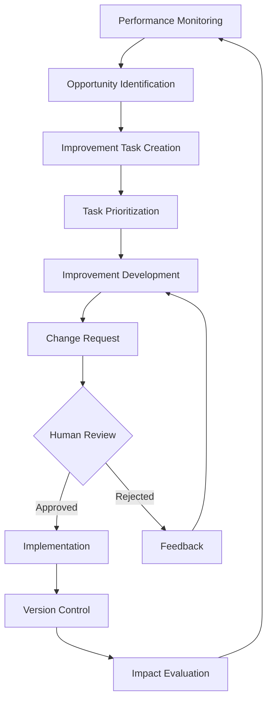

# Self-Improvement System

This document outlines the Self-Improvement System, a core component of the human-in-the-loop agent architecture that enables the system to recursively work on improving its own components.

## 1. Overview

The Self-Improvement System enables the agent architecture to continuously enhance its own capabilities by identifying improvement opportunities, creating improvement tasks, and implementing approved enhancements. This creates a virtuous cycle where the system becomes increasingly effective over time.

Key principles of the Self-Improvement System include:

- **Recursive Improvement**: The system can improve its own components
- **Continuous Monitoring**: Performance metrics are constantly tracked
- **Blocker Identification**: System identifies what prevents optimal performance
- **Human Oversight**: All improvements require human approval
- **Version Control**: All improvements are tracked with git
- **Measurable Impact**: Improvements are evaluated for effectiveness

## 2. System Components

### 2.1 Improvement Agent

The Improvement Agent is a specialized agent type focused on identifying and implementing system improvements:

```
└── agents/
    ├── improvement_agent.mjs    # Specialized for self-improvement tasks
    └── types/
        └── improvement_agent.mjs # Improvement agent class definition
```

### 2.2 Activity Improver

The Activity Improver focuses on enhancing activity definitions and guidelines:

```
└── activities/
    └── activity_improver.mjs    # Suggests improvements to activities
```

### 2.3 Task Improver

The Task Improver identifies ways to enhance task definitions and workflows:

```
└── tasks/
    └── task_improver.mjs        # Identifies task improvement opportunities
```

### 2.4 Inference Optimizer

The Inference Optimizer enhances inference requests and model selection:

```
└── inference/
    └── inference_optimizer.mjs  # Optimizes inference requests
```

## 3. Improvement Workflow

### 3.1 Core Improvement Loop



1. **Performance Monitoring**: System continuously monitors performance metrics
2. **Opportunity Identification**: Areas for improvement are identified
3. **Improvement Task Creation**: Tasks are created for identified opportunities
4. **Task Prioritization**: Improvement tasks are prioritized
5. **Improvement Development**: Specific improvements are developed
6. **Change Request**: Proposed improvements are submitted as change requests
7. **Human Review**: Human reviews and approves/rejects proposals
8. **Implementation**: Approved changes are implemented
9. **Version Control**: Changes are versioned in git
10. **Impact Evaluation**: Impact of improvements is evaluated
11. **Feedback Loop**: Evaluation feeds back into monitoring

### 3.2 Improvement Task Schema

```javascript
{
  task_id: 'string', // Unique identifier
  title: 'string', // Task title
  description: 'string', // Task details
  improvement_type: 'string', // 'activity', 'guideline', 'prompt', 'model', etc.
  target_id: 'string', // ID of the component to improve
  current_performance: {}, // Current performance metrics
  target_performance: {}, // Target performance metrics
  improvement_hypothesis: 'string', // Why this improvement should work
  blockers: [], // Current blockers preventing optimal performance
  status: 'string', // 'todo', 'in_progress', 'review', 'done'
  priority: 'number', // 1-5 priority level
  assignee: {
    type: 'string', // 'agent' or 'human'
    id: 'string' // ID of the assignee
  },
  created_at: 'timestamp',
  updated_at: 'timestamp',
  version: 'string' // Git version identifier
}
```

## 4. Improvement Types

### 4.1 Activity Improvements

The system can improve activities by:

- Refining activity definitions
- Updating activity relationships
- Enhancing activity metrics
- Optimizing model suggestions for activities
- Creating new activities for emerging patterns

### 4.2 Guideline Improvements

The system can improve guidelines by:

- Clarifying guideline language
- Updating requirement levels (MUST, SHOULD, MAY)
- Adding or refining examples
- Resolving guideline conflicts
- Creating new guidelines for uncovered scenarios

### 4.3 Prompt Improvements

The system can improve prompts by:

- Enhancing prompt clarity
- Optimizing prompt structure
- Adding relevant context
- Tailoring prompts for specific models
- Creating model-specific prompt variants

### 4.4 Model Selection Improvements

The system can improve model selection by:

- Updating model-activity associations
- Refining selection algorithms
- Optimizing parallel processing
- Enhancing evaluation criteria
- Improving cost-quality balancing

## 5. Improvement Identification

### 5.1 Performance Monitoring

The system monitors various performance metrics:

- **Task Completion Rate**: Percentage of tasks completed successfully
- **Inference Quality**: Quality scores of inference results
- **Human Approval Rate**: Percentage of changes approved by humans
- **Response Time**: Time to complete tasks or inference requests
- **Cost Efficiency**: Quality achieved per token cost
- **Guideline Compliance**: Adherence to established guidelines

### 5.2 Blocker Identification

The system identifies blockers that prevent optimal performance:

- **Knowledge Gaps**: Missing information or context
- **Capability Limitations**: Tasks beyond current capabilities
- **Resource Constraints**: Insufficient resources (time, tokens, etc.)
- **Guideline Conflicts**: Contradictory guidelines
- **Process Inefficiencies**: Suboptimal workflows

### 5.3 Opportunity Identification

The system identifies improvement opportunities through:

- **Pattern Analysis**: Recurring issues or suboptimal results
- **Comparative Analysis**: Differences between high and low performance
- **Human Feedback**: Direct feedback from human users
- **Model Comparison**: Differences in model performance
- **External Benchmarks**: Comparison to external standards

## 6. Implementation Details

### 6.1 Improvement Agent Implementation

```javascript
class improvement_agent extends base_agent {
  constructor(config) {
    super(config)
    this.improvement_focus = config.improvement_focus || 'general'
    this.target_components = config.target_components || []
  }
  
  async identify_opportunities() {
    // Analyze performance metrics
    const metrics = await this.get_performance_metrics()
    
    // Identify areas below target performance
    const opportunities = metrics
      .filter(metric => metric.current < metric.target)
      .map(metric => this.create_opportunity(metric))
    
    return opportunities
  }
  
  async develop_improvement(opportunity) {
    // Analyze current component
    const component = await this.get_component(opportunity.target_id)
    
    // Identify specific improvements
    const improvements = await this.generate_improvements(component, opportunity)
    
    // Create change request
    return this.create_change_request(improvements)
  }
  
  async evaluate_impact(improvement) {
    // Get pre-improvement metrics
    const pre_metrics = improvement.current_performance
    
    // Get post-improvement metrics
    const post_metrics = await this.get_performance_metrics(improvement.target_id)
    
    // Calculate impact
    const impact = this.calculate_impact(pre_metrics, post_metrics)
    
    return impact
  }
}
```

### 6.2 Continuous Questioning

The system continuously asks itself key questions:

```javascript
async function continuous_improvement_questions(context) {
  const questions = [
    "How can this component be improved?",
    "What is blocking or preventing optimal performance?",
    "What patterns indicate opportunities for enhancement?",
    "How can this process be made more efficient?",
    "What guidelines need clarification or refinement?",
    "How can we better measure success for this activity?",
    "What new capabilities would enable better results?"
  ]
  
  const answers = await Promise.all(
    questions.map(question => 
      inference_request({
        prompt: question,
        context: context,
        activities: ['self_improvement'],
        models: ['improvement_model']
      })
    )
  )
  
  return answers.map((answer, index) => ({
    question: questions[index],
    answer: answer,
    improvement_ideas: extract_improvement_ideas(answer)
  }))
}
```

### 6.3 Version Control Integration

All improvements are tracked with git:

```javascript
async function implement_improvement(improvement) {
  try {
    // Create git branch for improvement
    const branch_name = `improvement/${improvement.task_id}`
    await git_manager.create_branch(branch_name)
    
    // Make changes
    const changes = await apply_changes(improvement.changes)
    
    // Commit changes
    const commit_message = `Improve ${improvement.improvement_type}: ${improvement.title}`
    await git_manager.commit(commit_message, changes)
    
    // Create pull request
    await git_manager.create_pull_request(branch_name, 'main', commit_message)
    
    return {
      status: 'success',
      branch: branch_name,
      changes: changes
    }
  } catch (error) {
    // Revert changes on failure
    await git_manager.abort_changes()
    
    return {
      status: 'error',
      error: error.message
    }
  }
}
```

## 7. Human-in-the-Loop Collaboration

### 7.1 Improvement Approval Workflow

Humans remain integral to the improvement process:

1. System identifies improvement opportunity
2. System creates improvement task
3. System or human develops specific improvement
4. System submits change request
5. Human reviews proposed improvement
6. Human approves, rejects, or modifies
7. System implements approved improvement
8. System evaluates impact

### 7.2 Human Feedback Collection

The system actively collects human feedback:

- **Direct Feedback**: Explicit feedback on system outputs
- **Implicit Feedback**: Observation of human modifications
- **Approval Patterns**: Analysis of what improvements get approved
- **Rejection Patterns**: Analysis of what improvements get rejected
- **Suggestion Requests**: Explicitly asking for improvement ideas

### 7.3 Collaborative Improvement

Humans and the system collaborate on improvements:

- System identifies opportunities that humans might miss
- Humans provide creative insights and domain knowledge
- System implements detailed changes consistently
- Humans ensure improvements align with overall goals
- System tracks and evaluates improvement impact

## 8. Example Improvement Scenarios

### 8.1 Guideline Refinement

1. System notices that outputs frequently violate a particular guideline
2. Analysis shows the guideline is ambiguous or contradictory
3. Improvement task is created to refine the guideline
4. System proposes clearer language and better examples
5. Human reviews and approves the improved guideline
6. Updated guideline is implemented and versioned
7. System monitors compliance with the new guideline

### 8.2 Prompt Optimization

1. System detects that a particular model performs poorly with current prompts
2. Analysis shows the prompt structure doesn't match the model's strengths
3. Improvement task is created to optimize the prompt
4. System proposes model-specific prompt variants
5. Human reviews and approves the optimized prompts
6. New prompts are implemented and versioned
7. System evaluates performance improvement with new prompts

### 8.3 Activity Creation

1. System identifies a recurring pattern in user requests
2. Analysis shows no existing activity fully captures this pattern
3. Improvement task is created to define a new activity
4. System proposes activity definition and initial guidelines
5. Human reviews and refines the proposed activity
6. New activity is implemented and versioned
7. System begins tracking performance for the new activity

## 9. Conclusion

The Self-Improvement System creates a virtuous cycle where the human-in-the-loop agent architecture continuously enhances its own capabilities. By identifying improvement opportunities, creating improvement tasks, and implementing approved enhancements, the system becomes increasingly effective over time.

Key benefits of this approach include:

1. **Continuous Enhancement**: System capabilities evolve and improve
2. **Adaptation**: System adapts to changing requirements and patterns
3. **Efficiency**: Repetitive improvement tasks are automated
4. **Consistency**: Improvements are applied systematically
5. **Transparency**: All improvements are tracked and evaluated

The Self-Improvement System embodies the principle that the most powerful AI systems are those that can recursively improve themselves while maintaining human oversight and guidance. 