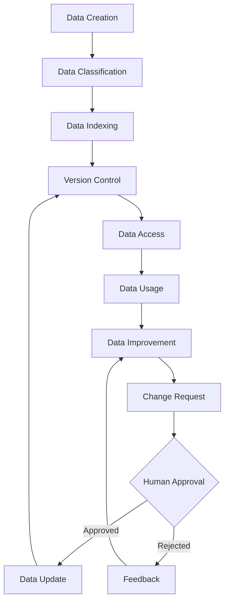
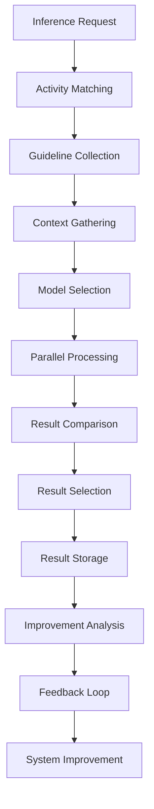
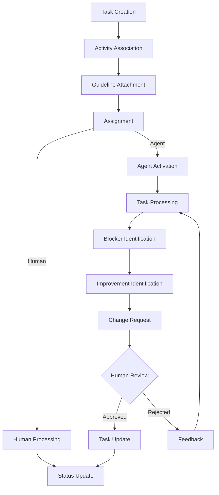
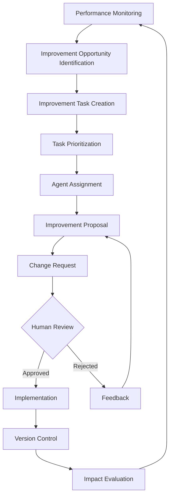

# Human-in-the-Loop Agent System Workflow

This document outlines the high-level workflows of the human-in-the-loop agent system, focusing on how data, activities, and agents interact to create a self-improving system.

## Core System Principles

1. **Everything is Data**: All system components (prompts, guidelines, tasks, etc.) are treated as versioned data items.
2. **Activity-Centric Organization**: Actions are classified by activity types to provide context and applicable guidelines.
3. **Multi-Model Inference**: Different models can process the same inference requests for comparison and selection.
4. **Continuous Improvement**: The system recursively works on improving its own components.
5. **Human Collaboration**: Humans remain in the loop for approvals, feedback, and guidance.
6. **Version Control**: All changes are tracked with git for accountability and rollback capability.

## Primary Workflows

### 1. Data Management Workflow

1. **Data Creation**: New data items are created (prompts, guidelines, tasks, etc.)
2. **Data Classification**: Items are classified by type and associated with relevant activities
3. **Data Indexing**: Data is indexed for efficient retrieval in future operations
4. **Version Control**: All data is versioned using git
5. **Data Access**: Access patterns are controlled based on permissions
6. **Data Usage**: Data is used in various system operations
7. **Data Improvement**: Opportunities for improvement are identified
8. **Change Request**: Proposed improvements are submitted as change requests
9. **Human Approval**: Humans review and approve/reject changes
10. **Data Update**: Approved changes are implemented and versioned

### 2. Inference Request Workflow

1. **Inference Request**: System receives a request for AI processing
2. **Activity Matching**: Request is matched to relevant activities
3. **Guideline Collection**: Guidelines for matched activities are gathered
4. **Context Gathering**: Relevant context data is collected
5. **Model Selection**: Appropriate models are selected based on the activity
6. **Parallel Processing**: Request is sent to multiple models in parallel
7. **Result Comparison**: Outputs from different models are compared
8. **Result Selection**: Best result is selected based on evaluation criteria
9. **Result Storage**: Results are stored with version control
10. **Improvement Analysis**: Opportunities for improvement are identified
11. **Feedback Loop**: Insights feed back into the system
12. **System Improvement**: System components are improved based on feedback

### 3. Task Management Workflow

1. **Task Creation**: New task is created (by human or agent)
2. **Activity Association**: Task is associated with relevant activities
3. **Guideline Attachment**: Guidelines for those activities are attached
4. **Assignment**: Task is assigned to human or agent
5. **Agent Activation**: If assigned to agent, agent is activated
6. **Task Processing**: Agent processes task according to guidelines
7. **Blocker Identification**: Agent identifies any blockers preventing completion
8. **Improvement Identification**: Agent identifies ways to improve the task
9. **Change Request**: Agent proposes changes via change request
10. **Human Review**: Human reviews proposed changes
11. **Task Update**: Task is updated based on approved changes
12. **Status Update**: Task status is updated

### 4. Self-Improvement Workflow

1. **Performance Monitoring**: System continuously monitors performance metrics
2. **Improvement Opportunity Identification**: Areas for improvement are identified
3. **Improvement Task Creation**: Tasks are created for identified opportunities
4. **Task Prioritization**: Improvement tasks are prioritized
5. **Agent Assignment**: Tasks are assigned to appropriate agents
6. **Improvement Proposal**: Agent develops improvement proposal
7. **Change Request**: Proposal is submitted as change request
8. **Human Review**: Human reviews and approves/rejects proposal
9. **Implementation**: Approved changes are implemented
10. **Version Control**: Changes are versioned in git
11. **Impact Evaluation**: Impact of improvements is evaluated
12. **Feedback Loop**: Evaluation feeds back into monitoring

## Cross-Cutting Concerns

### Version Control Integration

All system components use git for version control:

1. **Commit Creation**: Each approved change creates a git commit
2. **Branch Management**: Feature branches for major changes
3. **Merge Process**: Changes are merged after approval
4. **History Tracking**: Full history of all changes is maintained
5. **Rollback Capability**: Changes can be rolled back if needed

### Human-in-the-Loop Interaction

Humans remain integral to the system:

1. **Change Approval**: Humans approve or reject proposed changes
2. **Feedback Provision**: Humans provide feedback on agent outputs
3. **Guideline Creation**: Humans help establish and refine guidelines
4. **Priority Setting**: Humans set priorities for tasks and improvements
5. **System Oversight**: Humans maintain oversight of system operation

### Activity and Guideline Management

Activities and guidelines form the backbone of the system:

1. **Activity Definition**: Activities are defined with clear boundaries
2. **Guideline Creation**: Guidelines are created for activities using RFC 2119 keywords
3. **Association**: Data and tasks are associated with activities
4. **Evaluation**: Activities and guidelines are evaluated for effectiveness
5. **Refinement**: Activities and guidelines are refined based on feedback

## Implementation Considerations

1. **Modularity**: System components should be modular for easy replacement
2. **Extensibility**: System should be easily extensible with new activities and guidelines
3. **Observability**: All system operations should be observable for debugging
4. **Performance**: Critical paths should be optimized for performance
5. **Security**: Access controls should be enforced throughout the system
6. **Resilience**: System should be resilient to failures and errors

## Conclusion

This high-level workflow document provides a framework for implementing the human-in-the-loop agent system. The focus on data, activities, and continuous improvement creates a system that can evolve over time while maintaining human oversight and control. 