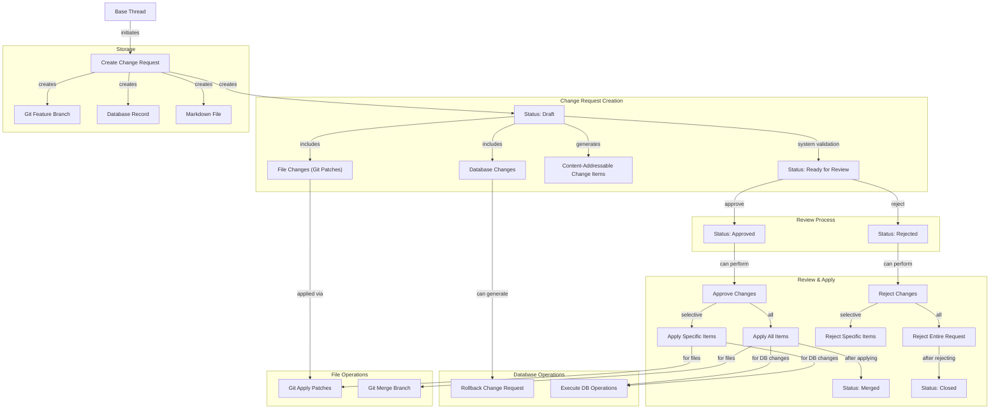

# Change Request System Design

This document outlines the design for the `change_request` system, which facilitates proposing, reviewing, and merging changes to both the knowledge base (files within the `system/` and `data/` directories) and database entities using a unified workflow.

## Core Concepts

1.  **Atomic Changes:** Each change request corresponds to a set of file modifications and/or database changes grouped together. File changes are isolated within a dedicated Git feature branch, while database changes are tracked in a structured format.

2.  **Hybrid Storage:** The system utilizes both the file system and a database:

    - **Markdown File:** A file (`data/change_requests/{change_request_id}.md`) stores descriptive information and acts as a discoverable artifact within the file-based knowledge system.
    - **Database Table:** A PostgreSQL table (`change_requests`) stores relationships, structured change data, and enables efficient querying and status tracking.

3.  **Optional GitHub Integration:** The system can optionally synchronize with GitHub Pull Requests for file changes, leveraging GitHub's UI for reviews, comments, and merging.

4.  **Thread Association:** Each change request is directly linked to the Base Thread that originated it, providing context and traceability.

5.  **Content-Addressable Changes:** Individual change items within a request are identified by content-addressable IDs (CIDs), enabling precise tracking and manipulation.

6.  **Partial Application:** The system supports applying or rejecting specific changes within a request, rather than requiring all-or-nothing operations.

7.  **Rollback Support:** Database changes can be rolled back by generating inverse operations, providing a safety mechanism for database modifications.

8.  **Change Request Status:** Each change request progresses through a defined workflow with statuses that indicate its readiness for review and application.

9.  **Unified File-Based Representation:** Database entities are represented as markdown files with frontmatter, enabling Git-based version control for all entity changes. Database changes are derived automatically from frontmatter modifications in file changes.

## Data Model

### 1. File (`data/change_requests/{change_request_id}.md`)

- **Purpose:** Stores descriptive metadata and content for discoverability and human readability. Aligns with the file-first principle of the broader system.
- **Schema:** Defined in `system/schema/change_request.md`.
- **Key Frontmatter Fields:**
  - `change_request_id`: (UUID) Unique identifier (matches DB primary key and filename).
  - `title`: (String) Concise summary.
  - `description`: (String) Detailed explanation (can be brief if body is used).
  - `thread_id`: (UUID) The Base Thread that initiated this change request.
  - `created_at`, `updated_at`: (Timestamps)
  - `status`: (String) Current status of the change request (default: `draft`). Values:
    - `draft`: Initial state, changes are being collected or worked on.
    - `ready_for_review`: System has validated the changes and recommends human review.
    - `approved`: Changes have been approved but not yet applied.
    - `rejected`: Changes have been rejected.
    - `merged`: Changes have been applied.
    - `closed`: Change request has been closed without being applied.
  - `target_branch`: (String) The base branch changes are intended for (e.g., `main`).
  - `feature_branch`: (String) The name of the Git branch containing the changes (e.g., `cr/{change_request_id}`).
  - `github_pr_url`, `github_pr_number`, `github_repo`: (Optional) GitHub integration details.
  - `tags`: (Array<String>) Relevant tags.
  - `type`: `change_request`
- **Markdown Body:** Contains extended descriptions, rationale, or context.

### 2. Database Table (`change_requests`)

- **Purpose:** Manages relationships, structured change data, and enables efficient querying.
- **Schema:**
  - `change_request_id` (UUID, Primary Key)
  - `title` (TEXT)
  - `thread_id` (UUID, NOT NULL) - Link to the originating thread
  - `created_at`, `updated_at` (TIMESTAMPTZ)
  - `status` (change_request_status_enum, NOT NULL, DEFAULT 'draft') - Current status using enum type
  - `target_branch` (TEXT)
  - `feature_branch` (TEXT, Unique)
  - `github_pr_url` (TEXT, Nullable)
  - `github_pr_number` (INTEGER, Nullable)
  - `github_repo` (TEXT, Nullable)
  - `changes` (JSONB) - Structured representation of all changes
  - `merged_at` (TIMESTAMPTZ, Nullable)
  - `closed_at` (TIMESTAMPTZ, Nullable)

### 3. Database Enums

- **change_request_status_enum:**
  ```sql
  CREATE TYPE change_request_status_enum AS ENUM (
    'draft',             -- Initial state, changes are being collected
    'ready_for_review',  -- System validated, ready for human review
    'approved',          -- Changes approved but not yet applied
    'rejected',          -- Changes rejected
    'merged',            -- Changes applied successfully
    'closed'             -- Closed without being fully applied
  );
  ```

### 4. Change Item Structure (JSONB)

The `changes` field in the database table contains a structured representation of all changes:

```json
{
  "file_changes": [
    {
      "change_item_cid": "hash-of-content",
      "path": "system/text/example.md",
      "operation": "update",
      "patch": "diff --git a/...",
      "description": "Updated introduction paragraph",
      "applied": false
    },
    {
      "change_item_cid": "hash-of-content",
      "path": "data/task/example-task-uuid.md",
      "operation": "update",
      "patch": "diff --git a/data/task/example-task-uuid.md b/data/task/example-task-uuid.md\nindex abc123..def456 100644\n--- a/data/task/example-task-uuid.md\n+++ b/data/task/example-task-uuid.md\n@@ -3,7 +3,7 @@\n title: \"Example Task\"\n type: \"task\"\n status: \"Planned\"\n-priority: \"Medium\"\n+priority: \"High\"\n entity_id: \"example-uuid\"\n ---\n ",
      "description": "Changed task priority from Medium to High",
      "applied": false
    }
  ],
  "db_changes": [
    {
      "change_item_cid": "hash-of-content",
      "entity_type": "task",
      "entity_id": "uuid-of-entity",
      "operation": "update",
      "table": "tasks",
      "fields": {
        "status": { "from": "Planned", "to": "In Progress" },
        "priority": { "from": "Medium", "to": "High" }
      },
      "description": "Updated task priority and status",
      "applied": false,
      "source_file_path": "data/task/example-task-uuid.md"
    }
  ]
}
```

## Workflow & Core Components



## Core API Functions

The system provides these primary functions for working with change requests:

### 1. Creating Change Requests

```javascript
create_change_request({
  title,
  thread_id, // Required - thread that originated changes
  file_changes: [], // Array of {path, content, operation, description}
  db_changes: [], // Array of {entity_type, entity_id, table, fields, operation, description}
  target_branch, // For file changes
  status: 'draft' // Default status
})
```

### 2. Updating Change Request Status

```javascript
update_change_request_status({
  change_request_id,
  status, // One of: 'draft', 'ready_for_review', 'approved', 'rejected', 'merged', 'closed'
  updater_id,
  comment
})
```

### 3. Approving & Applying Changes

```javascript
approve_change_request({
  change_request_id,
  approver_id,
  comment,
  change_item_cids: [] // If provided, only apply these specific items
  // If empty, apply all items in the change request
})
```

### 4. Rejecting Changes

```javascript
reject_change_request({
  change_request_id,
  rejector_id,
  comment,
  change_item_cids: [] // If provided, only reject these specific items
  // If empty, reject the entire change request
})
```

### 5. Creating Rollback Change Requests

```javascript
create_rollback_change_request({
  original_change_request_id,
  title,
  thread_id,
  change_item_cids: [], // Specific items to roll back
  // If empty, creates rollback for all DB changes
  status: 'draft' // Default status
})
```

## Implementation Details

### File Changes Handling

1. **Git Patch Generation:**

   - Instead of storing complete file content, file changes are stored as Git patches
   - Patches are generated using `git diff` or equivalent functionality
   - This approach reduces storage requirements and improves conflict detection

2. **Applying File Changes:**
   - Patches are applied using Git's patch application mechanisms
   - Can be applied selectively by filtering which patches to use
   - Maintains compatibility with Git's conflict resolution

### Database Changes Handling

1. **Automated Generation:**

   - Database changes are automatically derived from file changes that modify frontmatter
   - The system analyzes frontmatter diffs to create equivalent database operations
   - This ensures consistency between the file system and database representations

2. **Application Strategy:**

   - Transaction support ensures atomicity of related changes
   - Applied/unapplied status is tracked for each change item

3. **Rollback Generation:**
   - Inverse operations can be automatically derived from the original changes
   - Creates a new change request with opposite operations
   - Can be applied through the same approval mechanism

### Content-Addressable IDs

- Each change item receives a unique identifier based on a hash of its content
- This enables deterministic identification, deduplication, and selective operations
- Follows content-addressable storage principles (similar to Git's object model)

### Entity Representation

1. **Markdown Files with Frontmatter:**

   - All user-editable database entities are represented as markdown files
   - Entity properties are stored in YAML frontmatter
   - The file body contains additional rich content when applicable

2. **Database Synchronization:**
   - Changes to frontmatter in files are automatically synchronized to the database
   - This provides both Git-based version control and efficient database querying
   - The primary source of truth for entity data is the markdown file

## Key Implementation Areas

- **Directory:** `libs-server/change_requests/` (Core logic)
- **DB Table:** `change_requests` (Defined in `db/schema.sql`)
- **Schema File:** `system/schema/change_request.md` (Knowledge item type definition)
- **Git Operations:** `libs-server/git/git_operations.mjs` (Branching, patches, apply)
- **DB Operations:** New module for database change application and rollback
- **GitHub Integration:** `libs-server/integrations/github/` (Optional integration)

## Advantages

- **Unified Workflow:** Single system for both file and database changes
- **File-First Approach:** All entities are represented as markdown files, leveraging Git's capabilities
- **Flexible Application:** Support for partial or complete application of changes
- **Deterministic Tracking:** Content-addressable changes for reliable identification
- **Thread Context:** Maintained link to originating thread for full context
- **Storage Efficiency:** Git patches reduce storage requirements for file changes
- **Safety:** Database rollback capability for reversing changes when needed
- **Structured Review Process:** Status-based workflow enables clear progression from creation through system validation, human review, and final application
- **Simplified Mental Model:** Developers only need to think about file changes, while database operations are derived automatically
