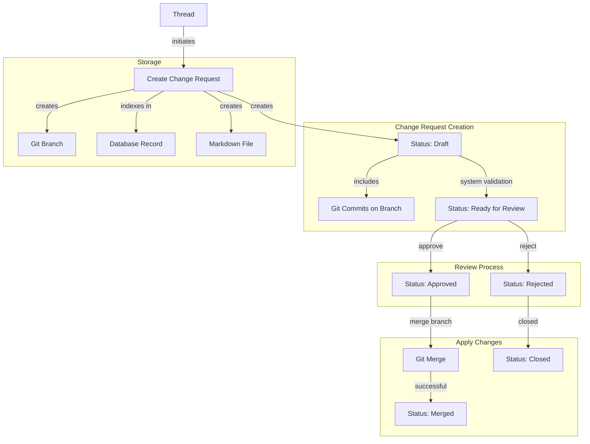

# Change Request System Design

This document outlines the design for the `change_request` system, which facilitates proposing, reviewing, and merging changes to the knowledge base using Git branches as the primary mechanism.

## Core Concepts

1. **Git-Based Changes:** A change request is a collection of one or more commits located on a non-main branch. These commits can target either:

   - The main branch (from a thread branch)
   - A thread branch (from a feature branch off the thread branch)

2. **Source of Truth:** Git and the filesystem serve as the source of truth for all changes. The database functions solely as an index for efficient querying and status tracking.

3. **Markdown File:** A file (`user/change-request/{change_request_id}.md`) stores descriptive information and acts as a discoverable artifact within the file-based knowledge system.

4. **Optional GitHub Integration:** The system can optionally synchronize with GitHub Pull Requests for file changes, leveraging GitHub's UI for reviews, comments, and merging.

5. **Thread Association:** Each change request is directly linked to the Thread that originated it, providing context and traceability.

6. **Change Request Status:** Each change request progresses through a defined workflow with statuses that indicate its readiness for review and application.

## Data Model

### 1. File (`user/change-request/{change_request_id}.md`)

- **Purpose:** Stores descriptive metadata and content for discoverability and human readability.
- **Schema:** Defined in `sys:schema/change_request.md`.
- **Key Frontmatter Fields:**
  - `change_request_id`: (UUID) Unique identifier (matches DB primary key and filename).
  - `title`: (String) Concise summary.
  - `description`: (String) Detailed explanation (can be brief if body is used).
  - `thread_id`: (UUID) The Thread that initiated this change request.
  - `created_at`, `updated_at`: (Timestamps)
  - `status`: (String) Current status of the change request (default: `draft`). Values:
    - `draft`: Initial state, changes are being collected or worked on.
    - `ready_for_review`: System has validated the changes and recommends human review.
    - `approved`: Changes have been approved but not yet applied.
    - `rejected`: Changes have been rejected.
    - `merged`: Changes have been applied.
    - `closed`: Change request has been closed without being applied.
  - `target_branch`: (String) The base branch changes are intended for (e.g., `main` or thread branch).
  - `feature_branch`: (String) The name of the Git branch containing the changes.
  - `github_pr_url`, `github_pr_number`, `github_repo`: (Optional) GitHub integration details.
  - `tags`: (Array<String>) Relevant tags.
  - `type`: `change_request`
- **Markdown Body:** Contains extended descriptions, rationale, or context.

### 2. Database Table (`change_requests`)

- **Purpose:** Indexes Git changes for efficient querying and status tracking.
- **Schema:**
  - `change_request_id` (UUID, Primary Key)
  - `title` (TEXT)
  - `thread_id` (UUID, NOT NULL) - Link to the originating thread
  - `created_at`, `updated_at` (TIMESTAMPTZ)
  - `status` (change_request_status_enum, NOT NULL, DEFAULT 'draft')
  - `target_branch` (TEXT)
  - `feature_branch` (TEXT, Unique)
  - `github_pr_url` (TEXT, Nullable)
  - `github_pr_number` (INTEGER, Nullable)
  - `github_repo` (TEXT, Nullable)
  - `merged_at` (TIMESTAMPTZ, Nullable)
  - `closed_at` (TIMESTAMPTZ, Nullable)
  - `merge_commit_hash` (TEXT, Nullable) - Hash of the merge commit when branch is merged
    - Stored to preserve access to commit information after feature branch deletion
    - Used to retrieve file diffs when viewing merged change requests

### 3. Database Enums

- **change_request_status_enum:**
  ```sql
  CREATE TYPE change_request_status_enum AS ENUM (
    'draft',             -- Initial state, changes are being collected
    'ready_for_review',  -- System validated, ready for human review
    'approved',          -- Changes approved but not yet applied
    'rejected',          -- Changes rejected
    'merged',            -- Changes applied successfully
    'closed'             -- Closed without being fully applied
  );
  ```

## Workflow & Core Components



## Implementation Details

### Branch Structure

1. **Thread Branches:**

   - Created from main branch
   - Can contain changes that will eventually target main
   - Named using thread identifier (e.g., `thread/{thread_id}`)

2. **Feature Branches:**
   - Created from thread branches
   - Contain changes that will target the parent thread branch
   - Named using feature/change request identifier (e.g., `feature/{change_request_id}`)

### Change Application

1. **Merge Process:**

   - Changes are applied by merging the feature branch into the target branch
   - Git handles conflict resolution during the merge process
   - The merge operation maintains full history and traceability

2. **Database Update:**
   - After successful merge, the database record is updated with status and timestamp
   - The database remains a queryable index, not the source of truth

## Key Implementation Areas

- **Directory:** `libs-server/change-requests/` (Core logic)
- **DB Table:** `change_requests` (Defined in `db/schema.sql`)
- **Schema File:** `system/schema/change_request.md` (Knowledge item type definition)
- **Git Operations:** `libs-server/git/index.mjs` (Branching, merging)
- **GitHub Integration:** `libs-server/integrations/github/` (Optional integration)

## Advantages

- **Git as Source of Truth:** Leverages Git's powerful versioning and branching capabilities
- **Simplified Model:** Clear branch-based change request model that aligns with Git workflows
- **Thread Context:** Maintained link to originating thread for full context
- **Structured Review Process:** Status-based workflow enables clear progression through review
- **Database as Index:** Database provides efficient querying without duplicating the source of truth

## Human Confirmation Workflows

The change request system supports various human confirmation workflows to balance efficiency with appropriate oversight:

- **Direct approval:** Human explicitly approves each change request
- **Batch approval:** Group of change requests approved together
- **Time-limited delegation:** Auto-approve for a set period
- **Risk-based approval:** Higher risk changes require higher approval requirements
