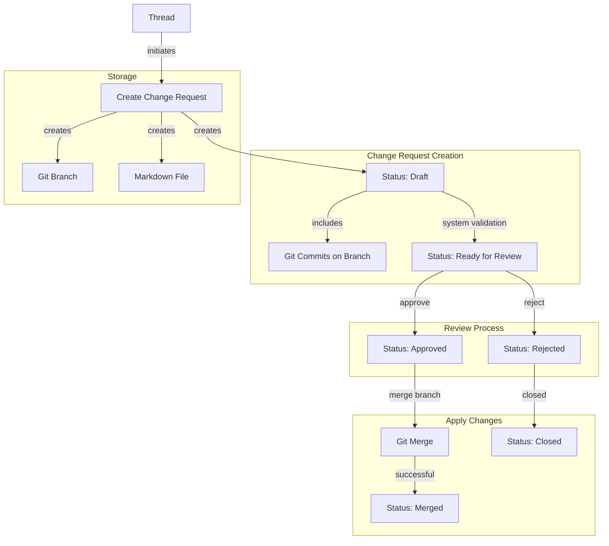

# Change Request System Design

> **HISTORICAL NOTE**: This change request system was removed in January 2025 as part of codebase simplification. The system was complete but unused in production, and its removal reduces complexity while preserving the file-first architecture. This documentation is preserved for historical reference.

This document outlines the design for the `change_request` system, which facilitates proposing, reviewing, and merging changes to the knowledge base using Git branches as the primary mechanism.

## Core Concepts

1. **Git-Based Changes:** A change request is a collection of one or more commits located on a non-main branch. These commits can target either:

   - The main branch (from a thread branch)
   - A thread branch (from a feature branch off the thread branch)

2. **Source of Truth:** Git and the filesystem serve as the source of truth for all changes.

3. **Markdown File:** A file (`user/change-request/{change_request_id}.md`) stores descriptive information and acts as a discoverable artifact within the file-based knowledge system.

4. **Optional GitHub Integration:** The system can optionally synchronize with GitHub Pull Requests for file changes, leveraging GitHub's UI for reviews, comments, and merging.

5. **Thread Association:** Each change request is directly linked to the Thread that originated it, providing context and traceability.

6. **Change Request Status:** Each change request progresses through a defined workflow with statuses that indicate its readiness for review and application.

## Data Model

### 1. File (`user:change-request/{change_request_id}.md`)

- **Purpose:** Stores descriptive metadata and content for discoverability and human readability.
- **Schema:** Defined in `sys:system/schema/change_request.md`.
- **Key Frontmatter Fields:**
  - `change_request_id`: (UUID) Unique identifier (matches filename).
  - `title`: (String) Concise summary.
  - `description`: (String) Detailed explanation (can be brief if body is used).
  - `thread_id`: (UUID) The Thread that initiated this change request.
  - `created_at`, `updated_at`: (Timestamps)
  - `status`: (String) Current status of the change request (default: `draft`). Values:
    - `draft`: Initial state, changes are being collected or worked on.
    - `ready_for_review`: System has validated the changes and recommends human review.
    - `approved`: Changes have been approved but not yet applied.
    - `rejected`: Changes have been rejected.
    - `merged`: Changes have been applied.
    - `closed`: Change request has been closed without being applied.
  - `target_branch`: (String) The base branch changes are intended for (e.g., `main` or thread branch).
  - `feature_branch`: (String) The name of the Git branch containing the changes.
  - `github_pr_url`, `github_pr_number`, `github_repo`: (Optional) GitHub integration details.
  - `tags`: (Array<String>) Relevant tags.
  - `type`: `change_request`
- **Markdown Body:** Contains extended descriptions, rationale, or context.

## Workflow & Core Components

## Human Confirmation Workflows

The change request system supports various human confirmation workflows to balance efficiency with appropriate oversight:

- **Direct approval:** Human explicitly approves each change request
- **Batch approval:** Group of change requests approved together
- **Time-limited delegation:** Auto-approve for a set period
- **Risk-based approval:** Higher risk changes require higher approval requirements
